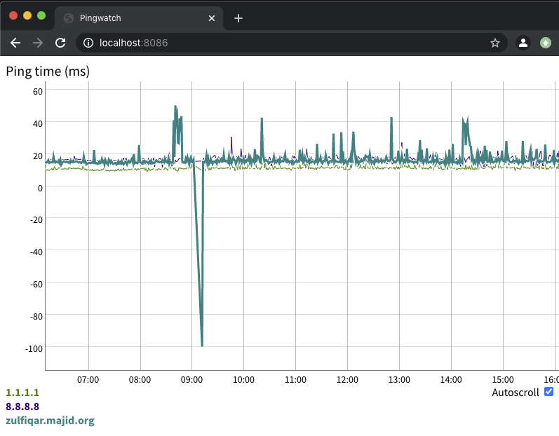

# pingwatch
Simple monitoring tool for your Internet connection, pings hosts and reports on availability and trends

## Screen shot



## Building

Prerequisites:

* Go 1.13 or later

```
git clone https://github.com/fazalmajid/pingwatch
cd pingwatch
go build
```

On Linux, run:

```
sudo setcap cap_net_raw=+ep pingwatch
```

this allows `pingwatch` to open raw sockets so it can send ICMP packets.

You can get a list of command-line flags using `pingwatch -h`

## Database

The list of hostnames or IPs to ping is in the table `dests`.

To add a destination, run:

```
sqlite3 pingwatch.sqlite << EOF
insert into dests values ('1.1.1.1'), ('8.8.8.8'), ('www.google.com');
EOF
```

The actual measurements are in the table `pings`:

* *time* timestamp in SQLite julian day format, UTC)
* *host* hostname that was pinged
* *ip* IPv4 or IPv6 address *host* resolved to at ping time
* *rtt* ping round-trip time in milliseconds

## Web user interface

The web user interface can be accessed at http://localhost:8086/ by default (or change it using the `-p` flag).

By convention, a ping time of -100ms means timeout, so downtime can stand out in the graph. In the SQLite database, this is stored as -3600e3

You can zoom in by selecting a time range, scroll using by pressing Shift while moving the mouse or zoom out back to the original view by double-clicking (graphs are courtesy of the awesome [Dygraphs](https://dygraphs.com) library).
